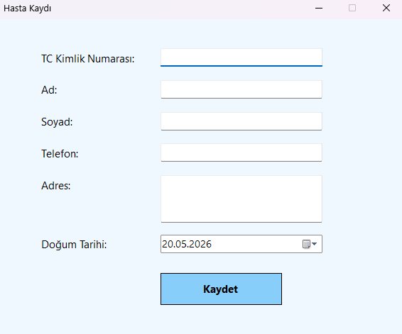
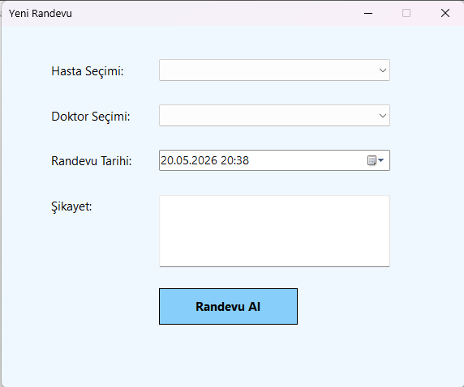

# 🏥 Hastane Otomasyonu

Bu proje, bir hastanenin temel işleyişini yönetmek amacıyla geliştirilmiş bir Windows Forms uygulamasıdır.

---

# 🚀 Özellikler

- Hasta ekleme
- Doktor ekleme
- Randevu oluşturma
- Hasta listeleme
- Doktor listeleme
- Randevu listeleme

---

# 🛠 Kullanılan Teknolojiler

- C#
- Windows Forms
- SQL Server LocalDB
- ADO.NET
- Visual Studio

---

# 🖼 Ekran Görüntüleri

## Ana Form

---

## Hasta Ekle

---

## Doktor Ekle

---

## Randevu Al

---

# ⚙️ Kurulum

1. Projeyi indirin
2. Visual Studio ile açın
3. Start (Başlat) butonuna basın
4. Veritabanı otomatik oluşturulacaktır

---

# ▶ Kullanım

- Ana ekrandan ilgili işlemi seçin
- Hasta ve doktor kayıtlarını oluşturun
- Randevu ekranından kayıtlı hasta ve doktora randevu verin
- Listeleme ekranlarından tüm kayıtları görüntüleyin

---

# 👨‍💻 Geliştirici

İbrahim Can Yurtsev

Görsel Programlama Dersi Projesi
